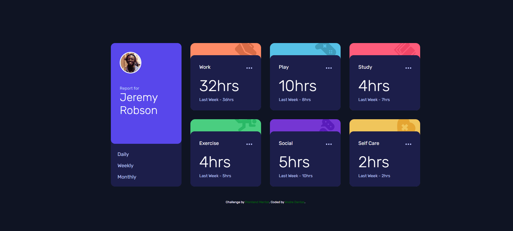

# Frontend Mentor - Time tracking dashboard solution

Esta é um solução para [Time tracking dashboard challenge on Frontend Mentor](https://www.frontendmentor.io/challenges/time-tracking-dashboard-UIQ7167Jw) 

## Table of contents

- [Overview](#overview)
  - [The challenge](#the-challenge)
  - [Screenshot](#screenshot)
  - [Links](#links)
- [My process](#my-process)
  - [Built with](#built-with)
  - [What I learned](#what-i-learned)
  - [Continued development](#continued-development)
  - [Useful resources](#useful-resources)
- [Author](#author)
- [Acknowledgments](#acknowledgments)

## Overview

### The challenge

Users should be able to:

- View the optimal layout for the site depending on their device's screen size
- See hover states for all interactive elements on the page
- Switch between viewing Daily, Weekly, and Monthly stats

Em pt-BR:

Os usuários devem ser capazes de:

- Visualizar o layout ideal para o site, dependendo do tamanho da tela do seu dispositivo
- Ver os estados de foco para todos os elementos interativos na página
- Alternar entre a visualização de estatísticas diárias, semanais e mensais

### Screenshot

### Links

- Solution URL: [Add solution URL here](https://andredantasti.github.io/desafio-time-tracking/)
- Live Site URL: [Add live site URL here](https://andredantasti.github.io/desafio-time-tracking/)

## My process

### Built with

- Semantic HTML5 markup
- CSS custom properties
- Flexbox
- CSS Grid
- Javascript (async..await, filter, map, array)
- API local- json

### What I learned

Aprendi e revisei sobre Layout CSS Grid e sua dependencias, Javascript, revisando a parte de API, async await, arrays, transforma object em array, javascript em modulos;

### Continued development

Pretendo continuar a praticar e aprender cada vez mais sobre Javascript caracterísitcas e agregar outras ferramentas para enriquecer nosso conhecimento;

## Author

- GitHub - [andredantasti](https://github.com/andredantasti)
- Frontend Mentor - [@andredantati](https://www.frontendmentor.io/profile/andredantasti)
- Linkedin - [Andre Dantas](https://www.linkedin.com/in/andre-dantas-84b370366/)
